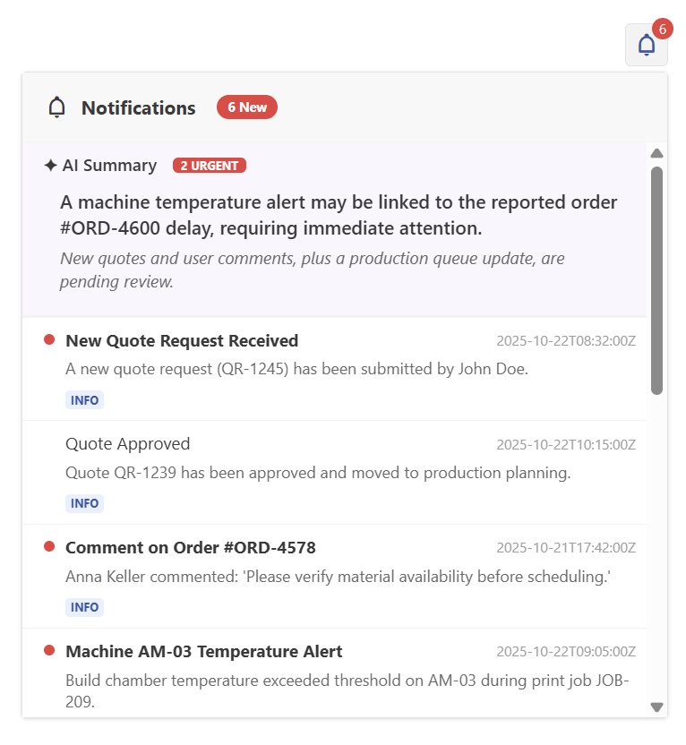

# 🔔 Kotti Notification Centre

A Notification Centre component built within the Kotti UI library. This component features AI-powered summarization to help users prioritize critical industrial alerts.

## Review and Test

1. **Open the Overlay**: Click the bell icon in the navigation to open the notification centre.
2. **AI Analysis**: Upon opening, the component automatically analyzes unread notifications and generates a summary targeting critical insights.
3. **Toggle Status**: Click any notification row to toggle between 'Read' and 'Unread'. The AI summary will stay persistent for the current session.

## Design and Architecture

- **Design**: I used clear grouping of notification information, with severity badges (ERROR, WARNING, INFO) placed in the footer for immediate recognition.
- **AI Integration**: Directly integrates with the Google Gemini API to give meaningful insights.

## Limitations

- **API Configuration**: The API call exposes the API key. For production, this should be moved to a backend via a proxy call.
- **AI Integration**: The AI integration is not fully implemented yet. (The AI summary is not persistent for the current session. More fine tuning of the AI prompt could be done.)
- **Controls**: The full list of controls are not implemented yet. (mark all read, filter by severity, clear all, etc.)
- **Unit Tests**: No unit tests have been written for this component.
- **Accessibility**: No accessibility testing has been done for this component.
